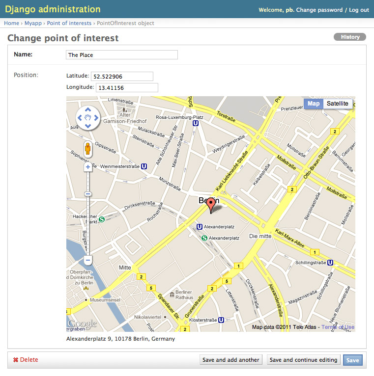

==================
django-geoposition
==================

A model field that can hold a geoposition (latitude/longitude), and corresponding admin/form widget.

.. image:: https://badge.fury.io/py/django-geoposition.svg
   :target: https://badge.fury.io/py/django-geoposition

.. image:: https://travis-ci.org/philippbosch/django-geoposition.png?branch=master
   :target: https://travis-ci.org/philippbosch/django-geoposition

.. image:: https://badges.gitter.im/philippbosch/django-geoposition.svg
   :alt: Join the chat at https://gitter.im/philippbosch/django-geoposition
   :target: https://gitter.im/philippbosch/django-geoposition?utm_source=badge&utm_medium=badge&utm_campaign=pr-badge&utm_content=badge

Prerequisites
-------------

Starting with version 0.2, django-geoposition requires Django 1.4.10 or greater. If you need to support
Django versions prior to 1.4.10, please use django-geoposition 0.1.5.

Installation
------------

- Use your favorite Python packaging tool to install ``geoposition``
  from `PyPI`_, e.g.::

    pip install django-geoposition

- Add ``"geoposition"`` to your ``INSTALLED_APPS`` setting::

    INSTALLED_APPS = (
        # …
        "geoposition",
    )

- Set your Google API key in you settings file::

    GEOPOSITION_GOOGLE_MAPS_API_KEY = 'YOUR_API_KEY'

  API keys may be obtained here: https://developers.google.com/maps/documentation/javascript/get-api-key

- If you are still using Django <1.3, you are advised to install
  `django-staticfiles`_ for static file serving.

Usage
-----

``django-geoposition`` comes with a model field that makes it pretty
easy to add a geoposition field to one of your models. To make use of
it:

- In your ``myapp/models.py``::

    from django.db import models
    from geoposition.fields import GeopositionField

    class PointOfInterest(models.Model):
        name = models.CharField(max_length=100)
        position = GeopositionField()

- This enables the following simple API::

    >>> from myapp.models import PointOfInterest
    >>> poi = PointOfInterest.objects.get(id=1)
    >>> poi.position
    Geoposition(52.522906,13.41156)
    >>> poi.position.latitude
    52.522906
    >>> poi.position.longitude
    13.41156

Form field and widget
---------------------

Admin
^^^^^

If you use a ``GeopositionField`` in the admin it will automatically
show a `Google Maps`_ widget with a marker at the currently stored
position. You can drag and drop the marker with the mouse and the
corresponding latitude and longitude fields will be updated
accordingly.

It looks like this:

|geoposition-widget-admin|

Regular Forms
^^^^^^^^^^^^^

Using the map widget on a regular form outside of the admin requires
just a little more work. In your template make sure that

- `jQuery`_ is included
- the static files (JS, CSS) of the map widget are included (just use
  ``{{ form.media }}``)

**Example**::

    
    <form method="POST" action="">
        {{ form.media }}
        {{ form.as_p }}
    </form>

Settings
--------

You can customize the `MapOptions`_ and `MarkerOptions`_ used to initialize the
map and marker in JavaScript by defining ``GEOPOSITION_MAP_OPTIONS`` or
``GEOPOSITION_MARKER_OPTIONS`` in your ``settings.py``.

**Example**::

    GEOPOSITION_MAP_OPTIONS = {
        'minZoom': 3,
        'maxZoom': 15,
    }

    GEOPOSITION_MARKER_OPTIONS = {
        'cursor': 'move'
    }

Please note that you cannot use a value like ``new google.maps.LatLng(52.5,13.4)``
for a setting like ``center`` or ``position`` because that would end up as a
string in the JavaScript code and not be evaluated. Please use
`Lat/Lng Object Literals`_ for that purpose, e.g. ``{'lat': 52.5, 'lng': 13.4}``.

You can also customize the height of the displayed map widget by setting
``GEOPOSITION_MAP_WIDGET_HEIGHT`` to an integer value (default is 480).

License
-------

`MIT`_

.. _PyPI: http://pypi.python.org/pypi/django-geoposition
.. _django-staticfiles: http://github.com/jezdez/django-staticfiles
.. _Google Maps: http://code.google.com/apis/maps/documentation/javascript/

.. _jQuery: http://jquery.com
.. _MIT: http://philippbosch.mit-license.org/
.. _MapOptions: https://developers.google.com/maps/documentation/javascript/reference?csw=1#MapOptions
.. _MarkerOptions: https://developers.google.com/maps/documentation/javascript/reference?csw=1#MarkerOptions
.. _Lat/Lng Object Literals: https://developers.google.com/maps/documentation/javascript/examples/map-latlng-literal
